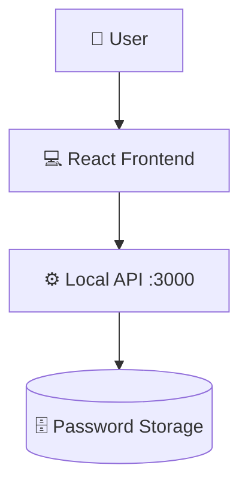

# 🔐 PassSafe - Personal Password Manager


---

## 📖 About The Project

**PassSafe - Personal Password Manager** is a modern web-based application that helps users securely **store, manage, edit, delete, and copy their passwords** from a single dashboard.  

Built using **React, Vite, and TailwindCSS**, PassSafe focuses on **simplicity, speed, and user experience** with a clean UI and real-time feedback system.

---

## ✨ Key Features

- 🔐 **Add & Store Passwords** – Save site name, URL, username, and password.
- 👁 **Show / Hide Password** – Toggle password visibility.
- 📋 **One-Click Copy** – Copy username or password to clipboard.
- ✏️ **Edit Passwords** – Modify existing credentials.
- 🗑 **Delete Passwords** – Secure deletion with confirmation.
- 🔔 **Live Popup Notifications** – Real-time alerts.
- 🎨 **Modern UI** – Built with TailwindCSS.
- ⚡ **Fast Performance** – Powered by Vite.

---

## 📸 Screenshots

### Main Dashboard


---

## 📁 Directory Structure

The project is organized as follows:

```
Directory structure:
└── be-a-guptaji-password-manager/
    ├── README.md
    ├── index.html
    ├── package.json
    ├── postcss.config.js
    ├── tailwind.config.js
    ├── vite.config.js
    ├── .eslintrc.cjs
    └── src/
        ├── App.css
        ├── App.jsx
        ├── index.css
        ├── main.jsx
        └── components/
            ├── Footer.jsx
            ├── Manager.jsx
            └── Navbar.jsx
```

### Key Folders and Files:

- **/components**: Contains reusable UI components.
- **Manager.jsx**: Core logic for password management.
- **Navbar.jsx**: Top navigation branding.
- **Footer.jsx**: Application footer.
- **main.jsx**: React entry point.

---

## 🏗️ Architecture

The system follows a **simple client-server architecture**:

- **Frontend (React + TailwindCSS):** Handles UI, state, and interactions.
- **Backend API (Local JSON Server at :3000):** Stores and retrieves passwords.
- **UUID:** Generates unique IDs for password entries.
- **Clipboard API:** Handles copy actions.



---

## 🛠 Built With

- **Frontend:** React 18, Vite 5, TailwindCSS 3  
- **State Management:** React Hooks  
- **Utilities:** UUID  
- **Styling:** TailwindCSS  
- **Linting:** ESLint  

---

## ⚙️ Getting Started

### Prerequisites

- Node.js 18+
- npm / yarn / pnpm
- Local API server running at `http://localhost:3000`

---

### Installation

```bash
git clone https://github.com/be-a-guptaji/be-a-guptaji-password-manager.git
cd be-a-guptaji-password-manager
npm install
```

---

### Run

```bash
npm run dev
```

Visit:

```
http://localhost:5173
```

Backend API must run at:

```
http://localhost:3000
```

---

## 🛣️ Roadmap

- [x] Add & Store Passwords
- [x] Copy to Clipboard
- [x] Edit & Delete Passwords
- [x] Popup Notifications
- [ ] Encrypted Storage
- [ ] Authentication
- [ ] Cloud Database
- [ ] Mobile App Version

---

## 📜 License

MIT License © 2025 Aryan Baadlas

---

## 📬 Contact

👨‍💻 **Aryan Baadlas**  
📧 **aryanbaadlas@gmail.com**

---

### ⭐ Show some love!

If you like this project, **give it a star ⭐ on GitHub**!
